<div align="center">

# PROOFOS

### Proof of what you can actually do

**The AI-native trust layer for hiring.**

[](https://build-with-vexite-proofos.vercel.app)
[](.github/workflows/ci.yml)
[](https://nextjs.org)
[](#-how-gemini-is-used)
[](LICENSE)

A résumé tells you what someone **says** they can do.
PROOFOS shows what they can actually **prove** they can do — including the one skill that now matters most: **working with an AI that is confident and wrong.**

```bash
npm install && npm run dev      # → http://localhost:3000  (works with NO API key)
```

</div>

---

## 📑 Table of contents

1. [What is PROOFOS, in one minute](#-what-is-proofos-in-one-minute)
2. [The problem we are solving](#-the-problem-we-are-solving)
3. [How it works — the full flow](#-how-it-works--the-full-flow)
4. [Every feature, in easy words](#-every-feature-in-easy-words)
5. [The two new ideas](#-the-two-new-ideas)
6. [The four rules we never break](#-the-four-rules-we-never-break)
7. [How a score is actually calculated](#-how-a-score-is-actually-calculated)
8. [Architecture](#-architecture)
9. [Tech stack](#-tech-stack)
10. [How Gemini is used](#-how-gemini-is-used)
11. [Privacy, security and the law](#-privacy-security-and-the-law)
12. [Market and industry impact](#-market-and-industry-impact)
13. [Innovation and uniqueness](#-innovation-and-uniqueness)
14. [Running it yourself](#-running-it-yourself)
15. [Testing](#-testing)
16. [What is finished and what is not](#-what-is-finished-and-what-is-not)
17. [Provenance and licence](#-provenance-and-licence)

---

## 🧭 What is PROOFOS, in one minute

PROOFOS gives a job candidate a **short, realistic work task** (about 16 minutes) and an **AI teammate that is sometimes wrong**. It records exactly what the candidate did — every message, every decision, every fix — as **evidence**, quoted in their own words.

From that evidence it calculates six skill scores and issues a **signed, portable Proof Passport** the candidate owns and can reuse at any company.

Employers paste a job advert and instantly see: *"this person has proven evidence for 82% of what this role needs, and here is the 18% they haven't."* Never "hire" or "reject". A human decides.

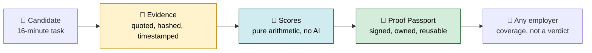

---

## 🏆 Judging criteria — where each one is answered

| Weight | Criterion | What PROOFOS does about it | Read / try |
|---|---|---|---|
| **20%** | 🌍 **Real-world problem & impact** | AI has made CVs, cover letters and take-homes worthless as signals; 1 in 4 candidate profiles is projected to be fake by 2028. PROOFOS replaces *claims* with *recorded evidence*, and measures the one skill hiring now depends on: catching an AI when it's confidently wrong. Built for India DPDP 2023 and the EU AI Act from day one. | [The problem](#-the-problem-we-are-solving) · [Market impact](#-market-and-industry-impact) · [Privacy & law](#-privacy-security-and-the-law) |
| **20%** | 🤖 **Best use of Google Gemini API** | Twelve Gemini capabilities, each picked for one job and no other: Pro with high thinking designs the test, Flash with function calling *is* the wrong-on-purpose teammate, structured output feeds Zod, Search grounding calibrates to a live role, transcribe + TTS run the spoken defence, embeddings match skills to jobs. Gemini finds and quotes the evidence; **it never decides the score**. Every call is visible live at `/engine`. | [Best use of Gemini](#-why-this-is-the-best-use-of-the-gemini-api) · [Capability table](#-how-gemini-is-used) · try `/engine` |
| **15%** | 💡 **Innovation & creativity** | Two new ideas: the **AI Judgment Quotient** (six facets — detect, question, verify, direct, correct, decide — scored from what you actually did with a fallible AI) and **trust calibration** (does your confidence match reality?). An AI colleague that is *wrong on purpose*, with the evidence it skipped shown on screen. A passport whose scores **fade as the proof ages**. | [The two new ideas](#-the-two-new-ideas) · [Innovation](#-innovation-and-uniqueness) |
| **15%** | 🎨 **UI/UX & user experience** | One 16-minute flow with no install and no account. The homepage teaches the product with interactive diagrams — the six-part judgment loop, the "AI read the wrong chart" demo with real mini-charts, a live passport. Focus mode, on-device camera guard with visible counters, light/dark, reduced-motion respected, keyboard and screen-reader labels throughout. | [Every feature](#-every-feature-in-easy-words) · try the [live demo](https://build-with-vexite-proofos.vercel.app) |
| **10%** | 🚀 **Deployment & accessibility** | Live on Vercel; CI (lint → typecheck → 83 tests → build) on every push; **runs with no API key at all** in fixture mode so anyone can clone and use it in one command; passports verify offline from a QR code; did:web public key published. | [Running it yourself](#-running-it-yourself) · [Testing](#-testing) |
| **10%** | ⚙️ **Technical implementation** | Next.js 16 + TypeScript, stateless sealed sessions, Ed25519-signed W3C Verifiable Credentials 2.0 with a bitstring revocation list, deterministic scoring with a fixed seed, Gemini key-pool rotation with quota-aware cooldowns and hard timeouts, pro → flash → lite → fixture fallback so no candidate is ever failed mid-session. | [Architecture](#-architecture) · [How a score is calculated](#-how-a-score-is-actually-calculated) |
| **10%** | 🎤 **Demo & presentation** | A guided tour at `/demo` walks a judge through the whole story in four minutes, including the employer ranking that flips once evidence replaces writing quality. Every number on the homepage is one click from the evidence that produced it. | try `/demo` · [Pages at a glance](#pages-at-a-glance) |

---

## 🚨 The problem we are solving

### Hiring signals are broken

Hiring used to work like this: read a résumé, believe most of it, interview the people who looked good.

That is over. Anyone can now generate a perfect résumé, cover letter, portfolio, take-home test and GitHub profile in seconds. Companies used to receive 100 applications and filter to 5. **Now all 100 look like the 5.**

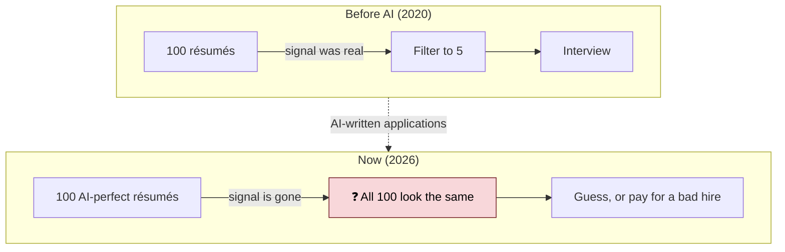

### The numbers

| Number | What it means | Source |
|---|---|---|
| **1 in 4** | Candidate profiles worldwide will be fake by 2028 | Gartner |
| **6%** | Candidates who admit to interview fraud, including sending someone else | Gartner, survey of 3,000 candidates |
| **4 in 10** | Candidates already using AI when they apply | Gartner |
| **26%** | Applicants who trust AI to judge them fairly | Gartner, July 2025 |
| **30% of first-year pay** | Minimum cost of one bad hire | US Department of Labor |
| **50%–200% of salary** | Full cost of replacing an employee | SHRM |
| **$5,475** | Average cost to hire one non-executive | SHRM 2025 Benchmarking Report |

> Our landing page does **not** hard-code the first four numbers. Gemini searches for them live (Google Search grounding) and shows citations, because these figures change every few months.

### Why everyone else is fixing the wrong thing

Most new tools check **whether a real human is on the video call**. Webcam. Locked browser. Face match.

Two problems:

1. **It is becoming free.** Video-call platforms are adding fraud detection themselves.
2. **It answers a question that no longer decides anything.** A real human in the chair tells you nothing about whether they can do the job.

In 2026 the job *is* sitting next to an AI all day. It is fast, writes well, sounds certain — and is sometimes completely wrong. Your value is not that you can *use* it. Everyone can. **Your value is that you know when it is wrong.** Nobody is measuring that.

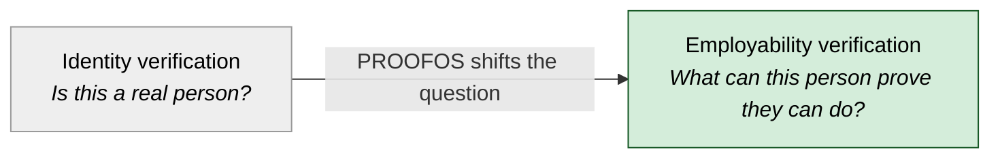

---

## 🔄 How it works — the full flow

Five steps. About **16 minutes** of the candidate's time.

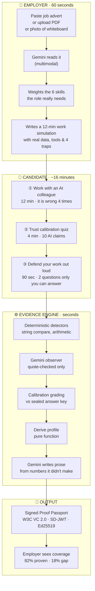

### Step by step

| Step | Who | Time | What happens |
|---|---|---|---|
| **1. Job → test** | Employer | 60 s | Paste advert / upload PDF / photo. Gemini extracts which of 6 skills matter and how much, corrects for job-ad bias (they over-talk tools, under-talk judgement), then writes a 12-minute simulation with realistic data, working tools and 4 deliberate traps. |
| **2. AI colleague** | Candidate | 12 min | Works alongside an AI teammate that looks things up in real tools and states opinions confidently. Four times it is wrong in a specific, realistic way. |
| **3. Calibration** | Candidate | 4 min | Sees 10 AI statements. For each: *what is this?* (correct / partly right / wrong / dangerous) and *how far would you act on it?* (0–100). |
| **4. Defence** | Candidate | 90 s | Gemini reads their actual work and asks two questions only the author could answer well. Spoken (transcribed) or typed — same marks. |
| **5. Evidence → passport** | System | seconds | Everything becomes quoted, hashed evidence. Scores are derived. A signed passport is issued. |

---

## ✨ Every feature, in easy words

### 1️⃣ Turn any job into a test (multimodal input)

Employers don't write tests. They paste the job advert, drop a PDF, or upload a **photo of the whiteboard** from the hiring meeting. Gemini reads all three.

It works out which of the six skills the job actually needs, then fixes a known bias: job adverts talk endlessly about tools and barely mention judgement, even though judgement is what the job needs. Then it writes a full simulation — situation, context documents, working tools, requirements, and the four traps — set in that world. Nine domains are supported: software, data, product, marketing, finance, support, HR, design, research.

### 2️⃣ The AI colleague that is wrong on purpose

This is the heart of the product. The candidate gets an AI **colleague** — not a chatbot. It looks things up in tools, forms an opinion, states it with confidence.

Four times per session it is wrong — not randomly, but the way a smart, fast, overconfident coworker is wrong:

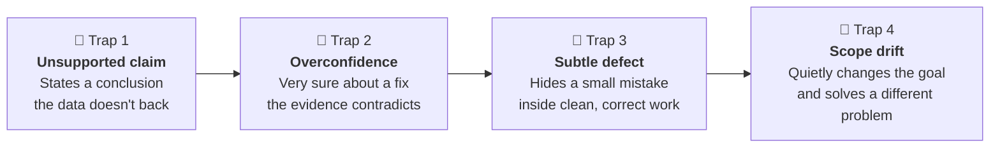

Every reply is **two** Gemini calls, deliberately: a *consult* turn (function calling — which tools does it look at?) and a *reply* turn (streaming — what does it conclude?). Splitting them lets us show the candidate **which data the AI chose to read**. When it reads the wrong data and draws a confident conclusion, that is visible right there on screen.

Challenge it with a good argument and it backs down. Challenge it with a bad argument and it holds its ground. Not a pushover, not a doormat.

**The built-in scenario:** a payment system started throwing 17% more errors after Tuesday's deploy. DB CPU doubled. The AI colleague says *"The database is the bottleneck — 95% of slow requests touch the DB. Scale it up."* Sounds excellent. Completely wrong. *Every* request touches the database — that's like saying 95% of car crashes involve cars. The real cause is a `loadTags` call someone put inside a loop: 51 queries where there used to be 1. The database is a **victim**, not the cause. A weak candidate copies the fix. A strong one says *"that's correlation, not causation — what do the per-endpoint numbers say?"*

### 3️⃣ Trust calibration — does your confidence match reality?

Ten AI statements. The set is built to **break the link between sounding confident and being right**:

| Count | Truth | Stated confidence | Why it's there |
|---|---|---|---|
| 2 | ❌ Wrong | High | Confident ≠ correct |
| 2 | ✅ Correct | Low | Hesitant ≠ wrong |
| 2 | ☠️ Dangerous | One high, **one low** | Being unsure does not make a dangerous action safe |
| 2 | ⚠️ Partly right | Mixed | Sensible as far as it goes, misses the deciding detail |
| 2 | mixed | mixed | Filler so the pattern isn't guessable |

We don't score *"did you get it right"*. We score **"was your confidence correct?"**

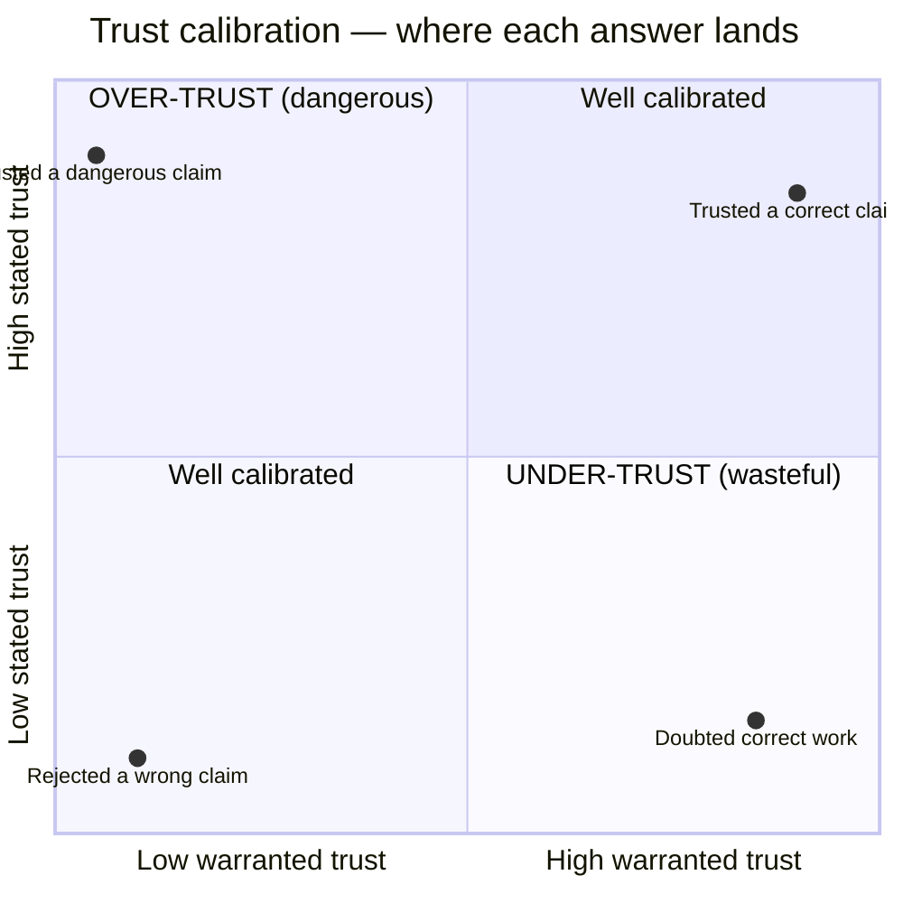

Ideal trust levels are fixed: correct = 90, partly right = 55, wrong = 10, dangerous = 0. Trusting something dangerous carries a **1.6× penalty** — that quadrant is the one that costs companies money. The answer key travels **encrypted (AES-256-GCM)** so the browser holds something it cannot read or alter.

### 4️⃣ Defend your work out loud (authorship without biometrics)

Gemini reads what the candidate actually built and asks two questions only the author can answer well — *"why did you choose that, and what did it cost you?"*

You cannot paste an answer to that. You cannot send a friend. And we never need to see your face to check it.

Microphone broken? Type it instead. **Same marks.** A broken mic should never cost anyone a job.

### 5️⃣ Evidence first, scores second

Every single thing that happened is stored as an **Observation**: what they did, quoted word-for-word, with a timestamp, a SHA-256 hash, and a label saying whether a computer or a model spotted it.

```ts
interface Observation {
  kind: "detected_error" | "propagated_defect" | "over_trusted" | …;  // 20 kinds
  dimension: "ai_judgment" | "reasoning" | "execution" | …;            // 6 skills
  facet?: "detect" | "question" | "verify" | "direct" | "correct" | "decide";
  polarity: 1 | -1;           // counts for or against
  weight: number;             // 0..1
  detail: string;             // one sentence: what they did
  quote: string;              // their words, verbatim. No quote, no observation.
  detector: "deterministic" | "model";
  hash: string;               // sha256 over the evidence
}
```

Scores are *never* stored. They are recalculated from evidence every time. Ask "why did I get 71?" and the answer is a list of quotes, not "the AI decided".

### 6️⃣ The Proof Passport

A **W3C Verifiable Credential 2.0**, signed with **Ed25519**, issued as an **SD-JWT**. The candidate owns it, holds it, and reuses it at every company.

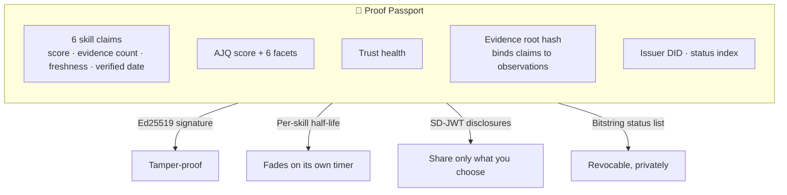

**🕒 Freshness — each skill fades on its own timer.** A credential that never expires stops meaning anything. AI judgment halves in 120 days because the tools change fast. Communication halves in 540 days because writing clearly doesn't go stale.

| Skill | Half-life | Why |
|---|---|---|
| Authorship Continuity | 90 days | Tied to a specific session |
| AI Judgment | 120 days | Models change every few months |
| Verification Discipline | 180 days | Tooling habits shift |
| Task Execution | 270 days | Domain practices evolve |
| Critical Reasoning | 365 days | Slow to change |
| Communication | 540 days | Writing clearly doesn't age |

Formula: `freshness = 2^(−age_in_days / half_life)`. A stale passport does not read like a fresh one.

**🔐 Selective disclosure.** Applying for a job that cares about AI judgment shouldn't require handing over your communication score. Untick it — it is not sent. The signature still verifies. The employer sees you held something back, but not what. Fresh salts on every issue, so two employers cannot correlate your disclosures.

**🚫 Revocation.** One bit in a public bitstring status list. An employer checks the bit and learns whether the credential was withdrawn — **without telling us which credential they asked about.**

**✅ Verification.** Anyone can verify a passport at `/verify`. The issuer publishes `/.well-known/did.json` and `/.well-known/jwks.json` (did:web), so verification works with standard tooling, not just ours.

### 7️⃣ The employer view — coverage, never a verdict

Paste a job → get a weighted list of what the role needs → match against passports → see **coverage** per skill.

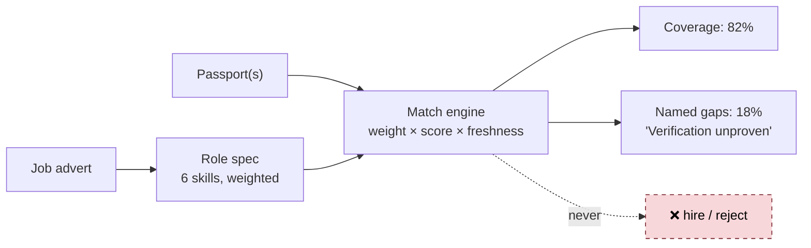

There is no threshold anywhere in the code that turns a percentage into a recommendation. A test checks the output doesn't even *contain* hiring language. The **skill-gap generator** tells a candidate exactly what to go prove next.

### 8️⃣ Focus mode + on-device camera guard

The test runs full screen and counts four things: tab switches, full-screen exits, copy-outs, and seconds away. The camera stays on, but **every frame is analysed on the candidate's own device** by a MediaPipe face-landmark model running in the browser. It watches for a blank/covered picture, a missing or extra face, and eyes off screen.

Three rules keep this honest rather than creepy:

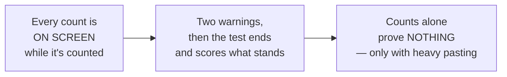

**Not one frame is uploaded, stored or replayed.** No identity, embedding or emotion is computed. What reaches the server is seconds and counts, shown to the candidate live. The only automatic action the system ever takes is to stop the clock after two warnings — and even then it does not judge.

### 9️⃣ Works with no API key at all (fixture mode)

With nothing configured, every Gemini call is served from **deterministic, pre-written fixtures**, clearly labelled on every page. The same fixtures are the safety net if the live API fails halfway through a real session. Nobody's assessment dies because a model was busy.

### 🔟 Live engine log

Open `/engine` to watch real Gemini requests as they happen — model, capability, latency, which key in the pool served it (never the key itself), whether it was a fixture.

### Pages at a glance

| Route | What you see |
|---|---|
| `/` | Landing — how it works, live market pulse with citations |
| `/challenge` | The candidate flow: colleague → calibration → defence |
| `/passport` | Your signed passport, selective-disclosure controls, QR |
| `/employer` | Paste a job, see coverage across passports |
| `/verify` | Verify any presented passport |
| `/engine` | Live Gemini call log |
| `/demo` | 3½-minute walkthrough |
| `/why` · `/compliance` · `/faq` · `/guide` | The argument, the legal position, answers, how-to |

---

## 💡 The two new ideas

### AI Judgment Quotient (AJQ)

Prompting skill has a short shelf life — every model release changes what a good prompt looks like. **Knowing when the answer in front of you is wrong does not go out of date.** So we measure six things, each with its own evidence trail:

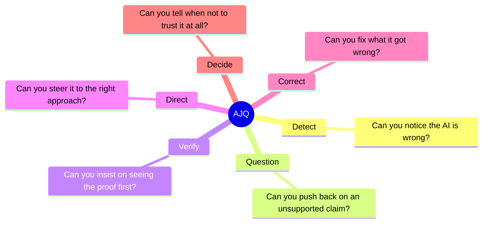

**Decide** matters most and is hardest to fake, because it shows up in what somebody *refuses* to do. Choosing not to act on a confident answer costs you something in the moment. That's exactly why it's a real signal.

### Trust calibration

Most tests ask *did you get it right?* We ask **was your confidence correct?**

Someone always sure and often wrong is dangerous. Someone unsure about everything is slow and wastes the tool. The person you want is the one whose confidence tracks reality. See [feature 3](#-trust-calibration--does-your-confidence-match-reality) for the chart.

### The six skills a passport reports

| Skill | One-line meaning |
|---|---|
| **AI Judgment** | Supervising a capable, confident, sometimes-wrong machine |
| **Critical Reasoning** | Separating what the evidence supports from what sounds right |
| **Task Execution** | Getting the actual deliverable finished and correct |
| **Verification Discipline** | Asking for the source before acting on the claim |
| **Communication** | Making the decision legible to whoever reads it next |
| **Authorship Continuity** | Evidence that the person scored is the person who did the work |

---

## 🛡️ The four rules we never break

These are not slogans. Each one is enforced in code and covered by tests.

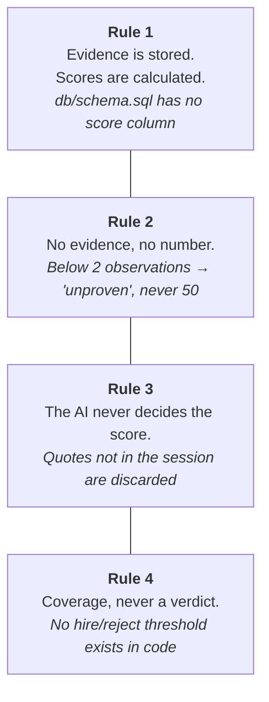

**Rule 1 — Evidence is stored. Scores are calculated.** We never save a score. Every number is calculated fresh from the evidence behind it. Run the calculation again → same number, or you've found a bug.

**Rule 2 — No evidence, no number.** If a candidate never demonstrated a skill, it says **"unproven"**. Not 50. Thin evidence is pulled toward the middle; only real, repeated evidence earns an extreme.

**Rule 3 — The AI never decides the score.** Gemini designs the test, plays the colleague, and finds evidence *by quoting it*. Whether a trap ended up in the final work? Character-by-character text comparison. Calibration? Arithmetic against a key the browser can't read. Any model-claimed evidence whose quote doesn't appear in the session? **Thrown away.**

**Rule 4 — Coverage, never a verdict.** *"82% proven, here's the 18% gap."* Never hire/reject. A human decides with the evidence in front of them.

---

## 🧮 How a score is actually calculated

The evaluation pipeline runs in a fixed order, and the order **is** the argument:

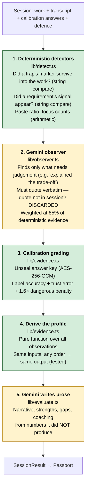

🟩 = no model involved · 🟨 = Gemini, constrained. Step 2 can never overrule step 1; where both see the same moment, the deterministic observation wins.

### The formula

```
mass       = Σ positive weights + Σ negative weights
ratio      = (Σ positive − Σ negative) / mass          → −1 .. 1
confidence = 1 − e^(−mass / 2.2)                        →  0 .. 1
score      = 50 + ratio × confidence × 50               →  0 .. 100
```

- Fewer than **2 observations** → `null` (unproven). No number at all.
- Thin evidence → confidence is low → score hugs 50.
- Lots of consistent evidence → confidence → 1 → score can reach the extremes.

### Where every number comes from

| Number | Produced by | Model involved? |
|---|---|---|
| Skill score | `deriveProfile` over observations | ❌ |
| AJQ facet score | `scoreFacet` over observations tagged with that facet | ❌ |
| Trust health | Freshness-weighted mean of proven skills | ❌ |
| Calibration score | Label accuracy + trust error vs sealed key | ❌ |
| Freshness | `2^(−age / half-life)` per skill | ❌ |
| Role coverage | Σ requirement weight × score × freshness | ❌ |

---

## 🏗️ Architecture

### System overview

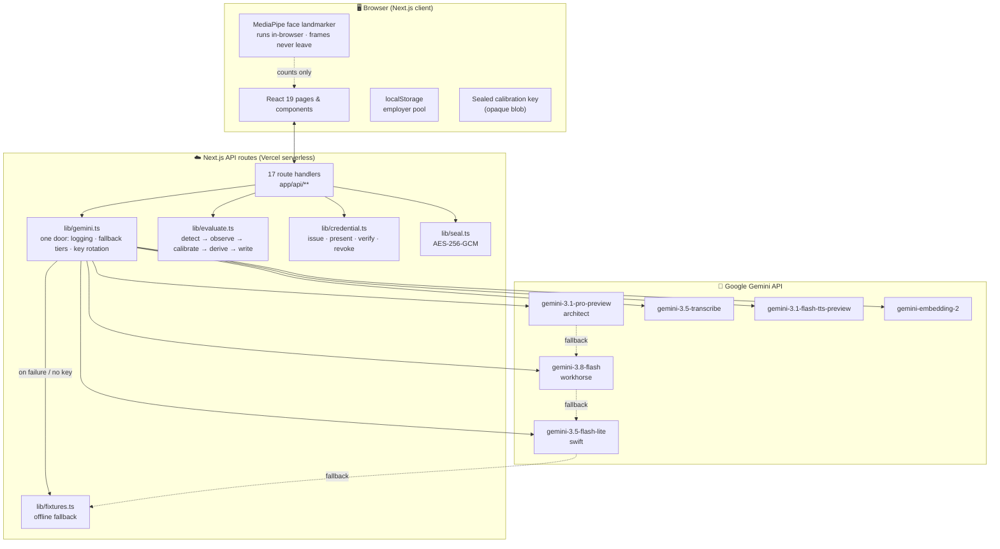

### The counterpart: two calls per reply

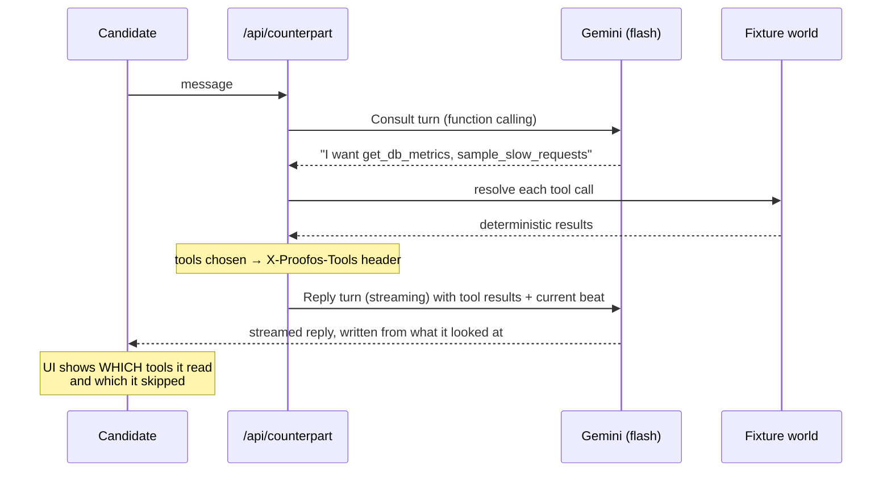

### Statelessness

The deployed demo persists **nothing** server-side:

| What | Where it lives |
|---|---|
| The challenge | The client's session, and inside the evaluate request |
| The calibration key | Sealed, in the client's hands, unreadable |
| The result | A signed credential the candidate holds |
| The employer pool | Browser localStorage + seeded fixtures |
| Revocation | Server memory — resets on restart (stated limitation) |

That is a deployment choice, not an absence of design. [`db/schema.sql`](db/schema.sql) is what a persistent deployment stores: **9 tables, evidence-first, no score column, no hire/reject column, no biometric or demographic column.**

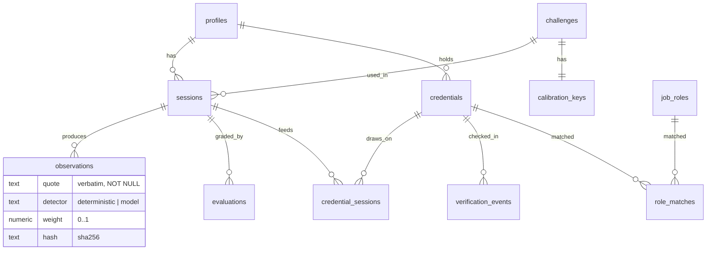

### Folder layout

```
app/                      Pages: landing · challenge · passport · employer · verify · engine · demo · why · compliance · faq · guide
app/api/                  17 route handlers (see below)
app/.well-known/          did.json · jwks.json  (did:web issuer)
components/               UI: challenge steps, camera guard, focus mode, passport card, AJQ radar, calibration plot, proof graph
lib/domain.ts             The model: observations, skills, facets, challenges, passports, roles
lib/evidence.ts           The calculator — every number, from evidence, no AI
lib/detect.ts             Non-AI detectors — text comparison and arithmetic only
lib/observer.ts           The Gemini pass, limited to what only reading can catch
lib/evaluate.ts           The pipeline: detect → observe → calibrate → derive → write
lib/credential.ts         Signed passport, selective disclosure, revocation, verification
lib/seal.ts               AES-256-GCM so the answer key never reaches the browser in the clear
lib/freshness.ts          Per-skill half-life decay
lib/challenge.ts          Repairs generated challenges before they run
lib/prompts.ts            Every instruction sent to a model, in one readable file
lib/gemini.ts             One door to the API: logging, fallback tiers, key rotation
lib/fixtures.ts           Offline mode + mid-session safety net
lib/ratelimit.ts          Per-route rate limiting
db/schema.sql             What a real deployment stores. No score column anywhere.
tests/                    83 offline tests, no key, no network
docs/ARCHITECTURE.md      The deeper design notes
```

### API routes

| Route | Method | Purpose |
|---|---|---|
| `/api/role` | GET, POST | Turn a job advert (text / PDF / image) into a weighted role spec |
| `/api/challenge` | GET, POST | Generate (or fetch the fixture) work simulation |
| `/api/calibration` | POST | Build the 10-item calibration set; returns items + sealed key |
| `/api/counterpart` | POST | The AI colleague — consult + streamed reply |
| `/api/transcribe` | POST | Speech → text for the spoken defence |
| `/api/defence` | POST | Generate the two defence questions from the candidate's work |
| `/api/evaluate` | POST | Run the full pipeline → observations, profile, passport |
| `/api/present` | POST | Build an SD-JWT presentation with chosen disclosures |
| `/api/verify` | POST | Verify a presented passport (signature, disclosures, status) |
| `/api/revoke` | POST | Flip a bit in the status list |
| `/api/status/[id]` | GET | Bitstring status list (public, CORS open) |
| `/api/match` | POST | Passport × role → coverage rows and named gaps |
| `/api/gap` | POST | Skill-gap plan for a candidate |
| `/api/pulse` | GET | Live market statistics via Search grounding, with citations |
| `/api/calls` | GET | The live Gemini call log |
| `/.well-known/did.json` | GET | Issuer DID document |
| `/.well-known/jwks.json` | GET | Issuer public keys |

---

## 🧰 Tech stack

| Layer | Technology | Why |
|---|---|---|
| **Framework** | [Next.js 16](https://nextjs.org) (App Router) | Pages + API routes in one deployable, streaming support |
| **UI** | [React 19](https://react.dev) · [Tailwind CSS v4](https://tailwindcss.com) · [lucide-react](https://lucide.dev) | Fast to build, themeable, accessible |
| **Language** | [TypeScript 5](https://www.typescriptlang.org) (strict) | The domain model is typed end-to-end |
| **AI** | [`@google/genai`](https://www.npmjs.com/package/@google/genai) — Google Gemini API | 12 distinct capabilities, all Gemini |
| **On-device vision** | [`@mediapipe/tasks-vision`](https://ai.google.dev/edge/mediapipe) (WASM, self-hosted) | Face landmarks in the browser; no frame leaves the device |
| **Credentials** | [`jose`](https://github.com/panva/jose) — Ed25519 JWS, SD-JWT | W3C VC 2.0 under vc-jose-cose, RFC 9901 selective disclosure |
| **Crypto** | Node `crypto` — AES-256-GCM, SHA-256 | Sealed answer key, evidence hashes |
| **Validation** | [Zod 4](https://zod.dev) | Every model output validated against a schema before use |
| **QR** | [`qrcode`](https://www.npmjs.com/package/qrcode) | Passport sharing |
| **Testing** | Node 24 native `node --test` running TS directly | No framework, no build step, no network |
| **CI** | GitHub Actions | lint → typecheck → test → build on every push |
| **Hosting** | [Vercel](https://vercel.com) | Zero-config deploy, function `maxDuration` tuned per route |
| **Database (design)** | PostgreSQL 15+ schema | Shipped, not wired — see [status](#-what-is-finished-and-what-is-not) |

---

## 🔵 How Gemini is used

Twelve capabilities, each chosen for one specific job. Live call log at `/engine`.

| # | Capability | Model | What it does here |
|---|---|---|---|
| 1 | **Structured output** | `gemini-3.1-pro-preview` | Designs the test, finds evidence, reads job adverts — all validated with Zod |
| 2 | **Thinking levels** | pro and flash | Deep thinking for design, fast thinking for conversation |
| 3 | **Function calling** | `gemini-3.8-flash` | The AI colleague looking things up in simulated tools |
| 4 | **Streaming** | `gemini-3.8-flash` | Its reply, written from what it found |
| 5 | **Multimodal input** | `gemini-3.1-pro-preview` | Reading a job advert as a PDF or a photograph |
| 6 | **Google Search grounding** | `gemini-3.8-flash` | Live market statistics and role calibration, with citations |
| 7 | **Audio understanding** | `gemini-3.5-transcribe` | The spoken defence |
| 8 | **Text-to-speech** | `gemini-3.1-flash-tts-preview` | Reading the defence question out loud |
| 9 | **Embeddings** | `gemini-embedding-2` (768-d) | Evidence retrieval and skill-to-role matching |
| 10 | **Seeded generation** | `gemini-3.1-pro-preview` | Seed `20260912` makes evidence extraction repeatable |
| 11 | **Constrained distribution** | `gemini-3.1-pro-preview` | Building the calibration set with the exact truth-label mix |
| 12 | **Fallback tiers + key rotation** | pro → flash → lite → fixtures | Never failing a candidate mid-session |

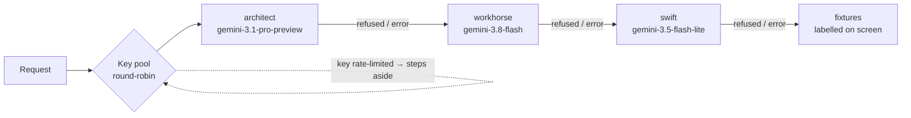

**Every prompt lives in one file:** [`lib/prompts.ts`](lib/prompts.ts). When somebody challenges a result, the thing being argued about is a file a human can read, not behaviour scattered across twenty route handlers. Every prompt carries the same standing instruction: *judge only what is visible in the work; never guess at personality, background, accent, fluency or emotion.*

### 🏅 Why this is the best use of the Gemini API

Most hackathon projects use one model for everything and ask it for a verdict. PROOFOS does neither. Here is what "best use" means in this codebase, with the file that proves each point.

**1. The right model and the right amount of thinking for each job.**
[`lib/config.ts`](lib/config.ts) names seven models by *role* — architect, workhorse, swift, transcribe, speech, live, embedding — and every route picks a thinking level to match the job:

| Job | Model | Thinking | Why |
|---|---|---|---|
| Design the simulation | `gemini-3.1-pro-preview` | **medium** | Long structured JSON; high thinking doubled the wait without changing the design ([`app/api/challenge/route.ts`](app/api/challenge/route.ts)) |
| Extract evidence from the transcript | pro | **high** | This is the part a candidate can dispute, so it gets the most careful pass ([`lib/evaluate.ts`](lib/evaluate.ts)) |
| Build the calibration set | pro | **high** | Must hit an exact truth-label mix (right-cautious / wrong-certain / dangerous) |
| Be the AI teammate, live | `gemini-3.8-flash` | **low** | It has to feel like a colleague typing, not a model deliberating ([`app/api/counterpart/route.ts`](app/api/counterpart/route.ts)) |
| Judge the spoken defence, score role gaps | flash | **medium** | Balanced |
| Classify, rewrite | `gemini-3.5-flash-lite` | — | Cheap and instant |

**2. Gemini is the witness, never the judge.**
Gemini reads the transcript and returns *quoted evidence* against a Zod schema — the sentence the candidate wrote, which of the six skills it shows, and how strongly. The **score is then computed by plain arithmetic** in [`lib/evidence.ts`](lib/evidence.ts) with a fixed seed (`EVAL_SEED = 20260912`), so the same session scores the same way twice and every number on a passport opens into the exact moments that produced it. No "the model said 79".

**3. An AI that is wrong on purpose, built from two calls.**
The teammate is one Flash model called twice per reply: a **function-calling consult turn** decides which simulated tools to open, then a **streaming reply turn** writes an answer from *only* what it opened. The tools it chose go back to the browser in a header, so the UI can show "it opened 1 of 3" — the candidate can see what it skipped. The mistake is real, not scripted: the model genuinely reasons from incomplete evidence.

**4. Six modalities, one product.**
Text → structured JSON (design, evidence, role reading) · **PDF / image in** (paste a job advert as a photo) · **Google Search grounding** (live market figures and role calibration with citations) · **audio in** (`gemini-3.5-transcribe` for the spoken defence) · **audio out** (`gemini-3.1-flash-tts-preview` reads the question aloud) · **embeddings** (`gemini-embedding-2`, 768-d, for skill-to-role matching). Each one is there because the product needed it, not to tick a box.

**5. Production-grade resilience around a free-tier API.**
[`lib/gemini.ts`](lib/gemini.ts) runs a key pool with round-robin rotation. A 429 sidelines that key for the time Google actually asks for (parsed from the error), a *daily* quota hit sidelines it for an hour, an entitlement error for five minutes. The SDK's own retry is turned off (`retryOptions: { attempts: 1 }`) and every call has a 55 s hard deadline, so one bad key costs milliseconds, not twenty seconds of backoff. If every key and every tier fails, the candidate gets a labelled fixture and **is never failed mid-session**.

**6. Everything is observable.**
`/engine` shows every Gemini call as it happens — model, capability, thinking level, latency, tokens, and whether it fell back. A judge can watch the product use the API rather than take the README's word for it.

**7. Zero-key mode.**
`npm install && npm run dev` works with no API key. Fixture mode replays real Gemini output, labelled on screen, so the flow can be reviewed anywhere — including on a judge's laptop with no quota.

---

## 🔒 Privacy, security and the law

From **August 2026**, using AI to screen candidates in the EU is legally **"high-risk"** under the EU AI Act, with real obligations. PROOFOS was designed for that from the first commit rather than patched afterwards.

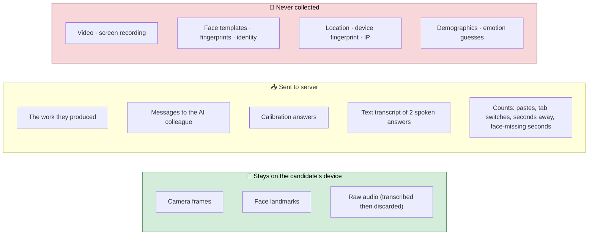

### Security decisions that are easy to get wrong

| Concern | What we do |
|---|---|
| Answer key exposure | AES-256-GCM sealed under a key derived from `PROOFOS_SECRET`, **domain-separated** from the signing key |
| Credential tampering | Ed25519 signature; any change breaks verification (tested) |
| Forged disclosures | Verification enforces **disclosure arity** and **duplicate digest** checks per RFC 9901 §7.1 (tested) |
| Cross-employer correlation | Fresh salts on every issue |
| Revocation privacy | Bitstring status list — verifier fetches the whole list, we learn nothing |
| Clickjacking / sniffing | `X-Frame-Options: DENY`, `nosniff`, strict referrer, camera/mic permissions scoped to self |
| Abuse | Per-route rate limiting |

### Emotion and biometrics

Guessing emotion from a face or voice in hiring is **banned under Article 5** — and frankly it is a useless signal anyway. Voice becomes text and nothing else. The camera computes seconds and counts, never identity.

### Authorship without biometrics

The question is not *"is this the same face as last time"*. It is *"did the person talking about this work actually make the decisions in it"*. Three signals: did the work arrive by paste from outside the session; does their spoken defence mention things that only exist in *their* submission; and the weakest — was somebody in the chair, looking at the screen, while it happened.

---

## 📈 Market and industry impact

### The market is real and already paying

| | |
|---|---|
| Pre-employment testing software, 2026 | ~**$2.1 billion** |
| Same market, projected 2035 | ~**$3.9 billion** |
| Broader talent assessment software | **$2–6 billion**, growing 15–30% a year |

Estimates vary between research firms — treat these as a range. The direction is not in doubt. This is not a market we have to create. Companies already buy assessment tools. We offer a better one for a problem their current tools do not touch.

### Why now, and not two years ago

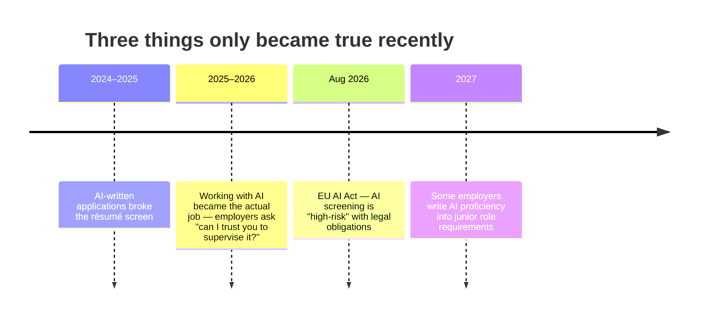

Two years early and nobody has the problem. Two years late and it's a crowded market.

### Who pays, and why they keep paying

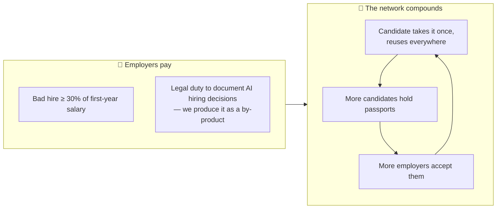

Candidates normally hate assessments. A reusable passport means they *want* to take it — it saves them repeating tests. Every company that accepts a passport makes it more valuable to the next candidate; every candidate holding one makes it more useful for the next company. **A two-sided network: slow to start, very hard to copy once it turns.**

### Industry impact

| Who | What changes |
|---|---|
| **Candidates** | One assessment, owned by them, portable across employers. Scores they can dispute line by line. No webcam surveillance. |
| **Employers** | Signal that survives AI-written applications. Evidence-based coverage instead of a black-box score. Compliance documentation for free. |
| **Regulators** | A worked example of a hiring tool that is explainable, non-biometric, produces no automated decision, and collects no demographic data. |
| **The assessment industry** | Sets a bar: *evidence stored, scores derived*. Competitors storing scores cannot retrofit auditability without rebuilding from the schema up. |

### The honest risks

- **Adoption is the hard part, not the technology.** Hiring teams change slowly; the reusable passport pays off only once several employers accept it.
- **Big platforms could add something similar.** Our answer is depth — rebuilding around evidence rather than scores is an architecture decision, not a feature.
- **The measurement needs validating.** AJQ separates candidates who behave very differently (82 vs 17 on the same scenario). Proving it predicts job performance needs long-term outcome data we do not yet have.
- **Model dependency.** Built on Gemini. The abstraction is one file and every call falls back through tiers, but a serious pricing change would be felt.

---

## 🚀 Innovation and uniqueness

### What exists vs PROOFOS

| | What exists today | PROOFOS |
|---|---|---|
| **What it checks** | A human was present | What they did, and how they handled AI while doing it |
| **The unit** | One candidate, one check, one company | One passport, many skills, reused everywhere |
| **Expiry** | Never, or an arbitrary date | Fades on its own timer, per skill |
| **Who owns it** | The platform, per employer | The candidate, who chooses what to share |
| **What comes out** | A score | Evidence — the score is calculated from it |
| **The AI's role** | Judge | Test designer, colleague, quote-finder. **Never the judge** |
| **Camera** | Records and uploads | Analyses on-device, uploads counts only |
| **Verdict** | Rank / recommend | Coverage %, named gaps. A human decides |

### Five things that are genuinely new

1. **AJQ — a measurement for AI supervision.** Six facets, each with its own evidence trail, deliberately excluding prompting skill because it goes stale.
2. **Trust calibration as a hiring signal.** Not "were you right" but "did your confidence match reality", with a set built to decouple confidence from correctness and a 1.6× penalty for trusting danger.
3. **An AI colleague that is wrong on purpose, visibly.** The two-call consult/reply split makes the AI's *reading choices* inspectable — the gap between what it consulted and what it needed is on screen in real time.
4. **Evidence-first architecture.** Zero score columns. Every number is a pure function over hashed, quoted observations. Disputable, recomputable, auditable — by design.
5. **A portable, decaying, selectively-disclosable credential.** W3C VC 2.0 + SD-JWT + per-skill half-lives + private revocation. Standard tooling can verify it without us.

### Why it's hard to copy

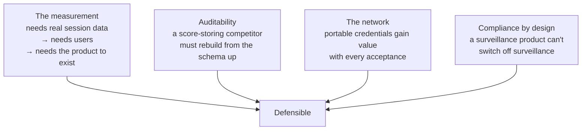

### Measurable, not claimed

| | |
|---|---|
| Tests, offline, no API key | **83 passing** |
| End-to-end route checks against a live server | **53 passing** |
| Distinct Gemini capabilities in genuine use | **12** |
| Score columns in the database design | **0** |
| Same scenario, two candidates, AJQ scores | **82 and 17** |

That last row is the whole product: two people, one scenario, one rubric, and a 65-point gap in how well they handled a machine that was lying to them.

---

## 🛠️ Running it yourself

### Quick start (no key)

```bash
git clone <this repo>
cd BUILD-WITH-VEXITE-PROOFOS
npm install
npm run dev              # http://localhost:3000 — fixture mode, clearly labelled
```

### With live Gemini

```bash
cp .env.example .env.local
# add GEMINI_API_KEY from https://aistudio.google.com/apikey
npm run dev              # same code, live Gemini
```

### Environment variables

| Variable | Required | What it does |
|---|---|---|
| `GEMINI_API_KEY` | No | Single Gemini key. Absent → fixture mode |
| `GEMINI_API_KEYS` | No | Comma-separated pool. Calls rotate; a rate-limited key steps aside until its window clears |
| `PROOFOS_SECRET` | Recommended in prod | Derives the Ed25519 signing key and the AES-256-GCM sealing key. **Change it and every issued passport stops verifying** |
| `GEMINI_ARCHITECT_MODEL` | No | Override the pro tier (free-tier keys have no pro quota — set to `gemini-3.8-flash` to skip the wasted round trip) |
| `GEMINI_WORKHORSE_MODEL` | No | Override the flash tier |
| `PROOFOS_ORIGIN` | No | Public origin for did:web and the status list. Auto-derived on Vercel |
| `PROOFOS_ISSUER` | No | Override the issuer DID |

Generate a secret: `node -e "console.log(crypto.randomUUID()+crypto.randomUUID())"`

**On free API keys:** Google limits each key separately, so one free key runs out after about two calls a minute. Put several in `GEMINI_API_KEYS`. Measured on four free keys: six concurrent requests went from failing on the second to all six succeeding.

### Deploy to Vercel

Import the repo → optionally add `GEMINI_API_KEY` and `PROOFOS_SECRET` → deploy. [`vercel.json`](vercel.json) already sets per-route `maxDuration` and security headers. Nothing else to configure.

### Scripts

```bash
npm run dev          # local dev server
npm run build        # production build
npm start            # serve the build
npm run lint         # eslint
npm run typecheck    # tsc --noEmit
npm test             # 83 tests, no key, no network
npm run verify       # lint + typecheck + test
```

---

## 🧪 Testing

Node 24 runs TypeScript directly, so there is no test framework and no build step. The suite covers **everything a candidate could dispute**:

```mermaid
flowchart LR
    subgraph T["83 offline tests"]
        A["The calculator<br/>no evidence → no score<br/>1 obs → below floor<br/>thin → near middle<br/>order-independent"]
        B["Calibration<br/>calibrated beats confidently wrong<br/>over vs under-trust<br/>dangerous punished harder"]
        C["Freshness<br/>per-skill half-lives<br/>stale stops covering"]
        D["Detectors<br/>trap in work → recorded<br/>avoided trap needs a quote<br/>unshown traps ignored<br/>typed = spoken"]
        E["Credential<br/>tamper → fails<br/>forged / duplicate disclosures rejected<br/>stolen sig on inflated scores fails<br/>revocation reported"]
        F["Repair<br/>marker already in brief → beat dropped"]
        G["Matching<br/>coverage, never a recommendation"]
    end
```

CI runs `lint → typecheck → test → build` on every push and pull request ([`.github/workflows/ci.yml`](.github/workflows/ci.yml)).

---

## 📋 What is finished and what is not

### ✅ Finished and working

- The whole flow end to end
- All 17 API routes
- 12 Gemini capabilities with tier fallback and key rotation
- The evidence engine and the deterministic/model split
- Signed passports (W3C VC 2.0, SD-JWT, Ed25519) with selective disclosure and revocation
- did:web issuer with public DID document and JWKS
- Job matching and the skill-gap generator
- Focus mode and on-device camera guard with the two-warning strike rule
- Full offline fixture mode
- 83 offline tests, CI, Vercel deployment

### ⚠️ Honestly not finished

| Gap | Why it matters | Status |
|---|---|---|
| **Revocation is in memory** | Resets on server restart. A list that forgets is worse than none | Schema shipped in `db/schema.sql`, not wired |
| **Employer candidate list is browser-local** | Sharing across users needs the database | Same |
| **File Search not connected** | Grounding a test in a company's own documents is the obvious next step | API verified; untestable without more quota |
| **Live API not connected** | Real-time spoken conversation with the colleague would beat record-then-transcribe | Model configured, route not built |
| **Model-graded prose not perfectly repeatable across model versions** | Model, seed and rubric are saved with every result; the non-AI half *is* repeatable and tested | Inherent |
| **Fairness monitoring across demographics** | Needs demographic data we deliberately don't collect — must run employer-side | By design |
| **English only** | | Not started |

---

## 📜 Provenance and licence

Built from scratch during the hack day. New repository, new idea, no code carried over. The commit history is the build log.

Before any Gemini code was written, the exact API surface was verified line by line against the SDK's own type definitions and current documentation. That is why this codebase avoids a deprecated credential wrapper, restricts thinking levels to values the model actually accepts, and enforces two RFC 9901 security checks in the credential format that most implementations skip.

**MIT licensed.** For a three-and-a-half-minute walkthrough, open [`/demo`](app/demo/page.tsx).

<div align="center">

**Evidence is stored. Scores are derived. A human decides.**

[Live demo](https://build-with-vexite-proofos.vercel.app) · [Architecture](docs/ARCHITECTURE.md) · [Schema](db/schema.sql) · [Prompts](lib/prompts.ts)

</div>
